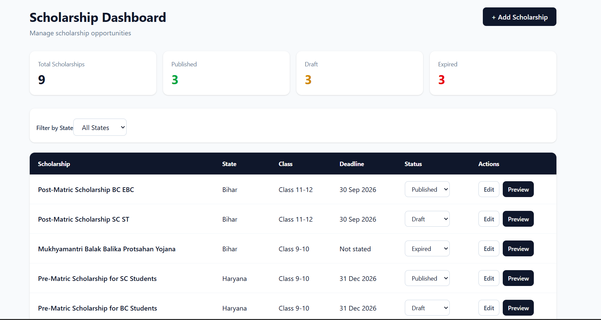

# Scholarship Dashboard

A frontend scholarship management dashboard built for the K12 Hunar Frontend Developer Assessment.

The application allows users to view, filter, add, edit, update the status of, and preview scholarship records through a simple dashboard interface.

**Live Demo:** [Scholarship Dashboard](YOUR_VERCEL_URL)



## Features

- Dashboard summary showing:
  - Total Scholarships
  - Published
  - Draft
  - Expired
- Filter scholarships by state:
  - Bihar
  - Haryana
  - Jharkhand
- View scholarship records in a responsive table
- Change scholarship status between Published, Draft, and Expired
- Add a new scholarship
- Edit existing scholarship details
- Preview scholarship information before leaving the dashboard
- Form validation for required fields
- Application URL validation
- Empty state when no scholarships match the selected state
- Responsive layout for desktop and smaller screens

## Tech Stack

- React
- Vite
- Tailwind CSS
- JavaScript

The project is frontend-only and uses local in-memory data. No backend, authentication, or database is required for this assessment.

## Project Structure

```text
src/
├── components/
│   ├── FilterBar.jsx
│   ├── PreviewModal.jsx
│   ├── ScholarshipForm.jsx
│   ├── ScholarshipTable.jsx
│   └── SummaryCards.jsx
├── data/
│   └── scholarships.js
├── App.jsx
├── index.css
└── main.jsx
```

## Getting Started

### 1. Clone the repository

```bash
git clone https://github.com/AGGARWALUDAY/k12-hunar-scholarship-dashboard.git
```

### 2. Open the project

```bash
cd k12-hunar-scholarship-dashboard
```

### 3. Install dependencies

```bash
npm install
```

### 4. Start the development server

```bash
npm run dev
```

The application will be available at the local URL shown in the terminal.

## Available Scripts

```bash
npm run dev
```

Starts the development server.

```bash
npm run build
```

Creates a production build.

```bash
npm run lint
```

Runs ESLint to check the source code.

```bash
npm run preview
```

Previews the production build locally.

## Data and State Management

The initial scholarship records are stored in:

```text
src/data/scholarships.js
```

Scholarship data is managed using React state in `App.jsx`.

Changes made through the dashboard are stored in the browser session while the application is running. Since this is a frontend-only assessment, data is not persisted to a backend or database.

## Validation

The scholarship form includes validation for required fields and checks that the application link uses a valid HTTP or HTTPS URL format.

The form prevents submission when required information is missing or when the application URL format is invalid.

## Assessment Scope

This project was built specifically for the K12 Hunar Frontend Developer Assessment.

The implementation focuses on the requested frontend functionality and intentionally does not include authentication, payment processing, email automation, or a production backend.

## AI / Reference Note

AI tools and documentation were used as development references during the implementation. The code was reviewed and adapted to fit the requirements of the assessment, and the application logic and implementation can be explained and discussed.

## Author

**Uday Aggarwal**

GitHub: https://github.com/AGGARWALUDAY